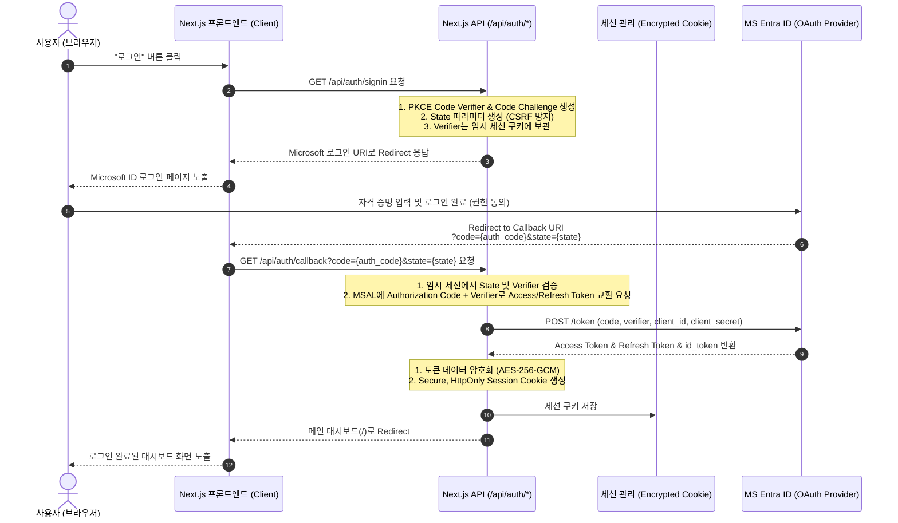
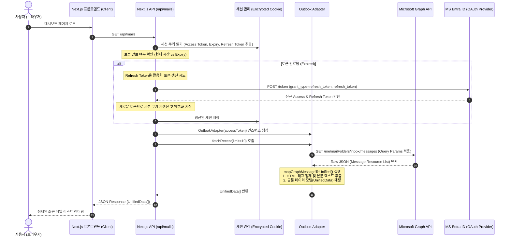

# Part 1: 시스템 아키텍처 및 제어 흐름 명세

> ⚠️ **역사 문서 (Phase 1 · TimePilot 시절)** — 초기 Microsoft 단일 채널 설계 기록으로, 현재 coffeTide 정본과 다릅니다. 특히 `/api/auth/signin`은 현행 설계에서 **게스트 세션** 시작점이며(MS OAuth 아님), `/api/auth/callback`은 미사용입니다. 신규 작업 기준: [`00-current-state.md`](./00-current-state.md) 및 Phase 3 이후 문서.

본 파트에서는 TimePilot Phase 1의 시스템 구조 및 제어 흐름(로그인 인증, 메일 수신)을 상세히 다룹니다.

## 1. OAuth 2.0 Authorization Code Flow with PKCE

Microsoft Entra ID 인증 절차 시 안전한 연동을 위해 PKCE(Proof Key for Code Exchange) 방식을 적용합니다.

### 1.1 인증 시퀀스 흐름

---

## 2. 데이터 동기화 및 갱신 제어 흐름

사용자가 메인 화면에 진입하여 최근 메일을 동기화하고, 백엔드 서버에서 세션 토큰 수명을 검사하여 유효하게 가공하는 상세 제어 구조입니다.

### 2.1 메일 동기화 시퀀스 흐름

