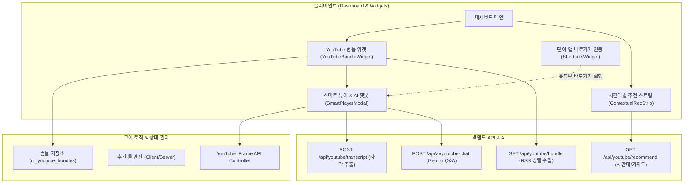

# ☕ coffeeTide 유튜브 뷰어·추천·묶음 통합 생태계 설계서

> **문서 번호**: `doc/11-youtube-viewer-recommendation-bundle-spec.md`  
> **작성 일자**: 2026-08-11  
> **상태**: 검토 및 승인 대기 (Draft for Review)  
> **관련 문서**: [`00-product-spec.md`](./00-product-spec.md), [`01-as-built-reference.md`](./01-as-built-reference.md), [`02-backlog.md`](./02-backlog.md), [`08-local-ai-enhancement-plan.md`](./08-local-ai-enhancement-plan.md)

---

## 1. 개요 및 배경 (Overview & Background)

### 1.1 제품 비전과의 연계
coffeeTide는 **"커피 한 잔 하면서 오늘을 정리하는 AI 업무 비서"**입니다. 사용자는 업무 시작 전, 휴식 시간, 점심시간, 퇴근길에 다양한 정보와 영상(경제 시황, IT/테크 동향, 업무 생산성 팁, 집중용 BGM 등)을 소비합니다.

현재 coffeeTide에는 단일 영상 iframe 임베드와 AI 질문 기능(`CustomNewsWidget`), 단축키 목록에서의 단순 YouTube 그룹 접기(`ShortcutsWidget`), 고정된 Mock 데이터 위젯(`ThreeProWidget`)이 개별적으로 분산되어 있습니다.

### 1.2 재설계 목표
1. **스마트 뷰어 (Smart Viewer)**: 단순 iframe 임베드를 넘어, 챕터 타임라인 탐색, 자막(Transcript) 기반 AI 3줄 요약, 타임스탬프 원클릭 점프, 미니 플레이어(PIP)를 지원하는 일체형 뷰어 구축.
2. **상황 맞춤 추천 (Contextual Recommendation)**: KST 시간대(출근/오전 집중/점심/오후 집중/퇴근/야간) 및 사용자의 관심 키워드(예: AI, 테크, 경제, 주식)에 따라 최적의 영상을 AI 바리스타와 대시보드가 자동으로 큐레이션.
3. **스마트 묶음 관리 (Smart Bundle & Playlists)**: 여러 YouTube 채널과 재생목록을 카테고리별(예: '경제/재테크', '개발/AI', '업무 집중 BGM')로 묶어 관리하고, 번들 단위로 최신 영상을 일괄 파싱하여 한눈에 브리핑받는 번들 위젯 제공.

---

## 2. 현행 구현 분석 및 격차 (As-Is vs To-Be)

| 항목 | 현행 구현 (As-Is) | 개선 설계 (To-Be) |
| :--- | :--- | :--- |
| **YouTube 뷰어** | • `CustomNewsWidget` 내 고정 240px `iframe`<br>• 수동 펼치기 시 단일 영상 재생<br>• Gemini 멀티모달 호출 시 쿼터 소모 및 429 취약 | • **`YouTubeSmartPlayer`**: 반응형 16:9 + 미니 플레이어 지원<br>• 자막(Transcript) 우선 추출 ➔ Gemini 텍스트 요약 (API 비용 90% 절감)<br>• 챕터(Chapter) 타임라인 바 & 타임스탬프 양방향 동기화 |
| **영상 추천** | • 사용자가 직접 URL을 넣어야 함<br>• 삼프로TV 고정 하드코딩 Mock 위젯 (`ThreeProWidget`) | • **상황/시간대별 스마트 추천 스트립** (아침 시황, 오후 BGM, 저녁 지식)<br>• **관심사 키워드 기반 추천** (YouTube RSS & 트렌드 피드 자동 수집)<br>• **AI 바리스타 대화 연동** ("집중 음악 틀어줘" ➔ 즉시 재생) |
| **묶음(Bundle)** | • `ShortcutsWidget`에서 바로가기 이름/URL에 "유튜브"가 있으면 단순히 아코디언으로 묶어 새 탭으로 링크 열기만 수행 | • **`YouTubeBundle` 1급 엔티티 정의**<br>• 1개 번들에 다중 채널/플레이리스트 포함 (탭 전환 UI)<br>• 번들 내 전체 최신 영상 **"일괄 AI 다이제스트 브리핑"** 제공 |
| **데이터 영속성** | • `ct_app_shortcuts` (단순 키워드-URL)<br>• `ct_custom_widgets` (단일 URL 사이트 위젯) | • `ct_youtube_bundles` (번들 프리셋 및 커스텀 번들)<br>• `ct_youtube_history` (최근 시청 및 질문 기록)<br>• Supabase Cloud Sync 및 IndexedDB 일자별 백업 연동 |

---

## 3. 상세 기능 설계 (Detailed Functional Spec)



### 3.1 스마트 유튜브 뷰어 (Smart YouTube Viewer)

1. **플레이어 제어 및 레이아웃**:
   - YouTube IFrame Player API (`window.YT.Player`) 표준 래퍼 구현.
   - 재생, 일시정지, 특정 시간 점프(`seekTo`), 음소거, 재생 속도 조절(1.0x, 1.25x, 1.5x, 2.0x) 지원.
   - 뷰어 모드:
     - **인라인 모드**: 위젯 카드 내에서 확장되어 재생.
     - **포커스 모달 모드**: 대형 화면으로 영상 시청 + 우측 실시간 AI 노트/Q&A 패널 분할 배치.
     - **PIP 미니 플레이어 모드**: 대시보드에서 다른 업무를 처리하면서 우측 하단에서 계속 재생.

2. **AI 자막 기반 초고속 요약 & 타임스탬프 챕터**:
   - 영상 URL 입력 시 YouTube 공식/자동 생성 자막(`timedtext`)을 우선 수집.
   - 자막이 존재할 경우 Gemini 텍스트 모델로 1~2초 내에 핵심 3문장 + 챕터별 타임스탬프 목차 생성.
   - 자막이 없는 경우 기존 영상 메타데이터(Description 목차) ➔ 폴백 Gemini 멀티모달 파이프라인으로 안전하게 전환.
   - 생성된 타임스탬프 버튼 클릭 시 플레이어가 해당 초(`seconds`)로 즉시 이동하며 자동 재생.

3. **대화형 AI 바리스타 영상 챗 (Video Chat)**:
   - "이 영상에서 결론이 뭐야?", "언급된 주요 수치만 표로 정리해줘", "2번째 주제 설명해줘" 등 대화형 질의응답 지원.
   - 답변 내에 인용된 시점이 포함되면 클릭 가능한 타임스탬프 뱃지로 자동 렌더링.

---

### 3.2 상황 맞춤형 스마트 추천 엔진 (Contextual Recommendation)

1. **시간대 기반 추천 프리셋 (KST 기준)**:
   - **06:00 ~ 09:00 (출근길/모닝 브리핑)**: 주요 뉴스, 모닝 경제 시황 (삼프로TV, 슈카월드, 주요 방송사 헤드라인).
   - **09:00 ~ 12:00 (오전 집중 업무)**: Deep Focus Lo-Fi, 코딩 BGM, 피아노 연주곡.
   - **12:00 ~ 13:30 (점심 휴식)**: IT 트렌드, 짧은 지식 교양, 테크 리뷰.
   - **13:30 ~ 18:00 (오후 집중 & 리프레시)**: 백색소음, 카페 앰비언스, 능률 향상 재즈.
   - **18:00 ~ 21:00 (퇴근길/자기계발)**: 기술 세미나, 개발 튜토리얼, 비즈니스 인사이트.
   - **21:00 ~ 24:00 (야간 힐링/정리)**: 잔잔한 수면/정리 음악, 하루 회고 컨텐츠.

2. **사용자 관심사 기반 키워드 피드**:
   - 설정 모달에서 사용자가 관심 키워드(예: `Next.js`, `LLM`, `부동산`, `거시경제`, `생산성`)를 등록.
   - YouTube RSS 및 검색 엔드포인트를 통해 최신 인기/추천 영상 3~5개를 매일 자동 큐레이션.

3. **AI 바리스타 프롬프트 연동**:
   - AI 바리스타 입력창에 *"집중할 때 들을 재즈 틀어줘"* 또는 *"오늘 슈카월드 최신 영상 보여줘"* 입력 시, 추천 영상을 찾아서 대시보드 뷰어로 바로 띄워주는 실행 파이프라인 연동.

---

### 3.3 스마트 묶음 관리 (Smart Bundle & Channel Grouping)

1. **번들(Bundle) 개념 정의**:
   - 여러 YouTube 채널 ID, 커스텀 핸들(`@channel`), 재생목록(Playlist)을 하나의 테마로 묶은 단위.
   - 예시 기본 제공 프리셋:
     - 📈 **경제/재테크 번들**: 삼프로TV, 슈카월드, 신사임당
     - 💻 **개발/테크 번들**: 생활코딩, 코딩애플, 노마드코더, 테크 유튜버
     - ☕ **카페/집중 BGM 번들**: Cafe Music BGM, Jazz Cafe, Lofi Girl
     - 🚀 **생산성/자기계발 번들**: 드림코딩, EO(이오), 자기계발 채널

2. **번들 통합 뷰어 위젯 (`YouTubeBundleWidget`)**:
   - 상단에 번들 내 채널 탭 목록 제공 (원클릭 전환).
   - 선택한 채널의 최신 영상 4~8개를 썸네일/제목/업로드일과 함께 카드 그리드로 표시.
   - **"✦ 번들 전체 AI 다이제스트"** 버튼:
     - 번들에 포함된 채널들의 최신 영상 제목/설명을 묶어서 Gemini가 종합 브리핑(예: *"오늘 경제 채널들의 공통 화두는 미국의 금리 결정과 반도체 수출 실적입니다."*) 생성.

3. **단어-앱 바로가기(`ShortcutsWidget`)와의 완벽한 연계**:
   - `ShortcutsWidget`의 'YouTube' 그룹을 클릭하면 외부 브라우저 탭으로 단순 이탈하는 대신, coffeeTide 내부의 번들 뷰어/플레이어로 매끄럽게 연결되는 옵션 제공.

---

## 4. 데이터 모델 및 스키마 (Data Models & Storage)

### 4.1 TypeScript 인터페이스 정의

```typescript
// 1. 개별 비디오 아이템
export interface YouTubeVideo {
  id: string;              // YouTube Video ID (11자리)
  title: string;           // 영상 제목
  url: string;             // 영상 전체 URL
  thumbnailUrl: string;    // 고화질 썸네일 URL
  publishedAt: string;     // 업로드 일시 (ISO String 또는 포맷팅된 문자열)
  channelTitle: string;    // 채널명
  channelId: string;       // 채널 고유 ID (UC...)
  description?: string;    // 영상 설명란
  duration?: string;       // 영상 길이 (예: "15:20")
  summary?: string;        // AI 생성 3줄 요약
  points?: string[];       // 핵심 포인트
  chapters?: YouTubeChapter[]; // 챕터/타임스탬프 정보
}

// 2. 영상 챕터 및 타임스탬프
export interface YouTubeChapter {
  time: string;            // "03:45"
  seconds: number;         // 225
  label: string;           // 챕터 소제목
}

// 3. 유튜브 채널/피드 정보
export interface YouTubeChannelSource {
  id: string;              // 채널 UC ID 또는 핸들
  name: string;            // 채널 표시 이름
  customUrl?: string;      // "@channel" 또는 URL
  avatarUrl?: string;      // 채널 프로필 이미지
  rssUrl: string;          // https://www.youtube.com/feeds/videos.xml?channel_id=...
}

// 4. 유튜브 묶음(Bundle) 정의
export interface YouTubeBundle {
  id: string;              // 번들 고유 ID (예: "bundle-finance")
  name: string;            // 번들명 (예: "경제·시황 심층")
  icon: string;            // 아이콘 이모지 (예: "📈")
  category: "finance" | "tech" | "bgm" | "study" | "custom";
  isPreset: boolean;       // 기본 프리셋 여부
  enabled: boolean;        // 활성화 여부
  channels: YouTubeChannelSource[]; // 포함된 채널 목록
  updatedAt: string;
}

// 5. 상황 맞춤 추천 아이템
export interface ContextualRecommendation {
  contextType: "morning" | "focus" | "lunch" | "evening" | "night" | "keyword";
  badge: string;           // "☕ 오전 집중 BGM", "📈 모닝 경제"
  videos: YouTubeVideo[];
  reason: string;          // 추천 사유
}
```

### 4.2 로컬 스토리지 키 규격 (`src/lib/localStore.ts`)

| Key | 타입 | 설명 |
| :--- | :--- | :--- |
| `ct_youtube_bundles` | `YouTubeBundle[]` | 사용자가 구성한 번들 목록 및 프리셋 상태 |
| `ct_youtube_active_bundle` | `string` | 현재 대시보드 위젯에서 선택된 활성 번들 ID |
| `ct_youtube_rec_keywords` | `string[]` | 사용자 지정 관심사 키워드 목록 |
| `ct_youtube_history` | `{ videoId: string; watchedAt: string; lastPos: number }[]` | 최근 시청 및 재생 위치 기록 |

---

## 5. API 명세 및 파이프라인 (API Specifications)

### 5.1 `GET /api/youtube/bundle`
- **목적**: 번들에 포함된 여러 채널의 최신 영상 목록을 병렬 수집하여 통합 피드 반환.
- **Query Params**: `bundleId` 또는 `channelIds` (콤마 구분)
- **응답 (JSON)**:
  ```json
  {
    "success": true,
    "bundleId": "bundle-tech",
    "videos": [
      {
        "id": "dQw4w9WgXcQ",
        "title": "Next.js 15 정식 릴리즈 총정리",
        "channelTitle": "코딩채널",
        "publishedAt": "2026-08-11T09:00:00Z",
        "thumbnailUrl": "https://i.ytimg.com/vi/dQw4w9WgXcQ/hqdefault.jpg"
      }
    ],
    "briefing": {
      "headline": "오늘의 테크 주요 이슈: 웹 프레임워크 업데이트 및 AI 모델 발표",
      "keyPoints": ["Next.js 15 안정화 버전 공개", "새로운 로컬 LLM 경량화 연구"]
    }
  }
  ```

### 5.2 `POST /api/youtube/transcript-summary`
- **목적**: 영상 자막(`timedtext`)을 가져와 빠른 텍스트 요약 생성 (Gemini 멀티모달 비디오 분석 대비 속도 5배 향상, 쿼터 보호).
- **Request Body**: `{ "videoId": "string", "url": "string" }`
- **응답 (JSON)**:
  ```json
  {
    "success": true,
    "summary": "영상 핵심 3문장 요약...",
    "points": ["포인트 1", "포인트 2", "포인트 3"],
    "chapters": [
      { "time": "00:00", "seconds": 0, "label": "도입부 및 배경" },
      { "time": "03:15", "seconds": 195, "label": "핵심 기술 변화점" }
    ],
    "source": "transcript" // 또는 "metadata" | "gemini_multimodal"
  }
  ```

### 5.3 `POST /api/ai/youtube-chat` (기존 기능 고도화)
- **개선점**: 기존 `fileData` 멀티모달 요청 전, 자막/메타데이터를 시스템 컨텍스트로 우선 주입하여 지연 시간 단축 및 429 오류 방지.

---

## 6. 컴포넌트 아키텍처 및 UI/UX 디자인

### 6.1 컴포넌트 구성도
```text
src/app/components/youtube/
├── YouTubeBundleWidget.tsx          # 퀵 위젯 바 및 대시보드 내 번들 탭 위젯
├── YouTubeBundleWidget.module.css   # Bento Grid 스타일 시트
├── SmartPlayerModal.tsx             # 16:9 반응형 뷰어 + 챕터 타임라인 + AI Q&A
├── MiniPlayerOverlay.tsx            # 우측 하단 PIP 플로팅 미니 플레이어
├── ContextualRecStrip.tsx           # 시간대/상황별 맞춤 추천 가로 스크롤 카드
└── settings/
    └── YouTubeBundleSection.tsx     # 설정 모달 내 번들 추가/편집/채널 관리
```

### 6.2 대시보드 UI/UX 배치
1. **퀵 위젯 토글 바**:
   - `[⏱️ 타이머] [🧮 계산기] [⭐ 바로가기] [☀️ 날씨] [📺 유튜브 번들]` 아이콘 추가.
2. **번들 위젯 카드 (Bento Card)**:
   - 상단: 번들 선택 드롭다운 + 채널 탭 칩(Chips) + "✦ AI 다이제스트" 버튼.
   - 중앙: 2x2 또는 1x4 비디오 썸네일 그리드 (마우스 호버 시 재생 미리보기 및 재생 시간 표시).
   - 클릭 액션: 카드 클릭 시 즉시 내장 스마트 뷰어 또는 모달 뷰어로 실행.
3. **스마트 뷰어 모달**:
   - 좌측 (60%): 유튜브 IFrame 플레이어 + 하단 챕터 타임스탬프 프로그레스 바.
   - 우측 (40%): AI 3줄 요약 카드 + 실시간 Q&A 대화창 + 타임스탬프 인용 점프 버튼.

---

## 7. 구현 로드맵 및 실행 단계 (Roadmap & Phases)

### 1단계: 코어 데이터 모델 및 번들 수집 API 구축
- [ ] `src/lib/types/youtube.ts` 타입 정의 (`YouTubeVideo`, `YouTubeBundle`, `YouTubeChapter` 등)
- [ ] `src/lib/youtube/presets.ts` 기본 번들 프리셋 구성 (경제, 테크, BGM, 자기계발)
- [ ] `src/lib/localStore.ts` 번들 관련 키(`LS_YOUTUBE_BUNDLES` 등) 추가
- [ ] `src/app/api/youtube/bundle/route.ts` 다중 채널 RSS 병렬 수집 & 캐시 API 구현

### 2단계: 스마트 유튜브 뷰어 & 자막 기반 AI 요약 고도화
- [ ] `src/app/components/youtube/SmartPlayerModal.tsx` IFrame API 양방향 제어 뷰어 구현
- [ ] `src/app/api/youtube/transcript-summary/route.ts` 자막 파싱 및 저비용 Gemini 텍스트 요약기 연동
- [ ] 챕터 타임스탬프 클릭 시 영상 자동 점프(`seekTo`) 및 자동 재생 연동
- [ ] AI 채팅 인터페이스 최적화 (`/api/ai/youtube-chat`)

### 3단계: 묶음(Bundle) 위젯 & 대시보드 통합
- [ ] `src/app/components/youtube/YouTubeBundleWidget.tsx` 번들 탭/채널 전환 Bento 위젯 구현
- [ ] `src/app/page.tsx` 퀵 위젯 바에 유튜브 번들 위젯 연동 및 레이아웃 배치
- [ ] `ShortcutsWidget.tsx`의 YouTube 바로가기 클릭 시 내부 번들 위젯/스마트 뷰어로 연결

### 4단계: 상황 맞춤형 추천 엔진 & AI 바리스타 연동
- [ ] KST 시간대별 추천 스트립(`ContextualRecStrip.tsx`) 구현 (모닝 경제, 집중 BGM 등)
- [ ] AI 바리스타 자연어 명령 연동 ("재즈 틀어줘", "삼프로TV 요약해줘" ➔ 번들/영상 자동 호출)
- [ ] 설정 모달 내 `YouTubeBundleSection.tsx` 번들 커스텀 편집 기능 추가

---

## 8. 검증 기준 및 품질 목표 (Verification Criteria)

1. **재생 및 제어 안정성**:
   - 임의의 YouTube URL 및 번들 채널 영상이 오류 없이 100% 임베드 재생되어야 함.
   - 타임스탬프 클릭 시 영상의 정확한 초 단위로 딜레이 없이 이동 및 재생되어야 함.
2. **AI 요약 속도 및 쿼터 효율**:
   - 자막 기반 요약 도입으로 영상 분석 응답 속도 < 3초 달성.
   - 429 쿼터 초과 시 메타데이터 기반 로컬 요약으로 자동 폴백되어 화면이 멈추지 않아야 함.
3. **번들 관리 및 UX**:
   - 번들 간 전환이 300ms 이내에 즉각 반응하며 캐시된 영상이 매끄럽게 렌더링되어야 함.
   - 모바일/데스크톱 뷰포트 반응형 레이아웃 깨짐 없음.
