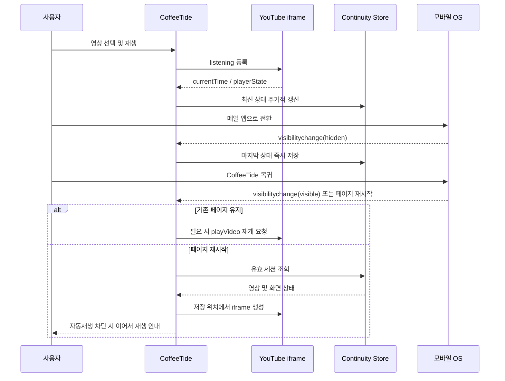

# CoffeeTide 모바일 앱 전환 연속성 구현 계획

> **문서 번호**: `doc/12-mobile-session-continuity-plan.md`  
> **작성 일자**: 2026-08-12  
> **상태**: 설계 완료 · 소스 미구현  
> **대상 환경**: iPhone Safari/PWA, Android Chrome/PWA  
> **관련 문서**: [`04-mobile-strategy.md`](./04-mobile-strategy.md), [`11-youtube-viewer-recommendation-bundle-spec.md`](./11-youtube-viewer-recommendation-bundle-spec.md)

---

## 1. 목적

사용자가 CoffeeTide에서 영상을 보거나 업무를 확인하다가 잠시 메일, 메신저 등 다른 모바일 앱으로 이동한 뒤 돌아왔을 때 다음 상태가 끊기지 않도록 한다.

- 열어 둔 YouTube 영상과 재생 위치
- 플레이어의 축소/확대 상태
- CoffeeTide의 스크롤 위치와 열어 둔 위젯
- 작성 중인 업무·질문 입력값
- 모바일 운영체제가 브라우저 탭을 종료한 경우에도 복원 가능한 최소 세션

이 기능의 목표는 다른 앱 위에 CoffeeTide나 영상을 계속 띄우는 것이 아니라, **잠시 앱을 전환한 뒤 CoffeeTide로 돌아왔을 때 직전 작업을 빠르게 이어가는 것**이다.

---

## 2. 범위와 제외 범위

### 2.1 구현 범위

1. `visibilitychange`를 이용한 모바일 앱 전환 감지
2. `pagehide`를 보조 신호로 사용하는 마지막 상태 저장
3. YouTube IFrame Player 메시지에서 실제 재생 시간과 재생 상태 수집
4. 작은 연속성 세션을 `localStorage`에 즉시 저장
5. 페이지가 유지된 경우 현재 iframe을 그대로 사용해 재생 연속성 유지
6. 페이지가 재시작된 경우 저장된 영상·위치·화면 상태 복원
7. 자동재생이 차단된 환경에서는 명확한 `이어서 재생` 동작 제공
8. 사용자가 플레이어를 직접 닫은 경우 자동 복원하지 않음

### 2.2 제외 범위

- 다른 앱 위에 CoffeeTide UI를 표시하는 시스템 오버레이
- iOS와 Android에서 동작이 다른 네이티브 PiP 또는 별도 앱 패키징
- 백그라운드에서 CoffeeTide JavaScript를 계속 실행하는 기능
- YouTube iframe 내부 UI 변경 또는 플레이어를 가리는 사용자 정의 오버레이
- 장기간 시청 기록의 서버 동기화

---

## 3. 현행 구조와 문제점

### 3.1 현재 동작

- `SmartPlayerModal`은 선택된 영상을 React 상태로만 보관한다.
- 모바일에서는 영상을 비차단형 축소 플레이어로 시작한다.
- 확대/축소 전환은 동일 iframe을 유지하므로 페이지가 살아 있는 동안에는 재생 위치가 유지된다.
- `ct_youtube_history`에는 최근 시청 영상이 기록되지만 `lastPos`가 항상 `0`으로 저장된다.
- `YouTubeBundleWidget`과 `ContextualRecStrip`의 `selectedVideo`는 새로고침 또는 탭 폐기 시 사라진다.

### 3.2 해결해야 할 문제

| 상황 | 현재 결과 | 목표 결과 |
|---|---|---|
| 메일 앱 확인 후 즉시 복귀 | 브라우저 상태에 따라 유지되거나 일시 정지 | 같은 영상과 화면을 유지하고 가능한 경우 재생 재개 |
| 모바일 OS가 탭을 폐기 | 선택 영상과 위치 소실 | 저장된 세션에서 영상과 위치 복원 |
| 페이지 재로드 | 최근 영상 목록만 남고 위치는 0초 | 마지막 위치로 이동 후 이어서 재생 안내 |
| 사용자가 플레이어를 닫음 | 해당 세션만 종료 | 연속성 세션도 삭제해 다음 방문 시 복원하지 않음 |
| 자동재생 차단 | 재개 명령이 실패할 수 있음 | 영상은 저장 위치에서 준비하고 사용자 탭으로 재생 |

---

## 4. 사용자 경험 설계

### 4.1 앱을 잠시 전환한 경우

1. 사용자가 CoffeeTide에서 영상을 재생한다.
2. 메일이나 메신저 앱으로 이동한다.
3. CoffeeTide가 `hidden` 상태가 되는 즉시 마지막 재생 위치와 화면 상태를 저장한다.
4. CoffeeTide로 돌아오면:
   - 기존 페이지가 살아 있으면 동일 iframe을 유지한다.
   - 재생 중이었던 영상은 브라우저가 허용하는 범위에서 재생 재개를 요청한다.
   - 사용자가 일시 정지했던 영상은 자동으로 재생하지 않는다.

### 4.2 모바일 OS가 페이지를 종료한 경우

1. CoffeeTide 재실행 시 유효한 연속성 세션을 확인한다.
2. 저장된 소유 화면을 복원한다.
   - 추천 영상: 추천 스트립 플레이어 복원
   - YouTube 번들: YouTube 위젯을 열고 플레이어 복원
3. 저장된 영상 ID와 `currentTime`을 iframe의 시작 위치로 전달한다.
4. 모바일 자동재생이 허용되지 않으면 플레이어 가까이에 `이어서 재생` 안내를 표시한다.
5. 배경 화면의 기존 스크롤 위치를 복원한다.

### 4.3 복원하지 않는 경우

- 사용자가 닫기 버튼으로 플레이어를 종료한 경우
- 저장 후 12시간이 지난 세션
- 영상 ID 또는 URL이 유효하지 않은 경우
- 다른 사용자가 로그인한 것으로 확인되는 경우
- 연속성 데이터의 버전 또는 형식이 올바르지 않은 경우

---

## 5. 상태 모델

### 5.1 저장 키

```text
ct_youtube_continuity_v1
```

### 5.2 데이터 구조

```ts
type YouTubeContinuityOwner = "contextual" | "bundle";

interface YouTubeContinuitySessionV1 {
  version: 1;
  owner: YouTubeContinuityOwner;
  video: YouTubeVideo;
  videoId: string;
  currentTime: number;
  playerState: "playing" | "paused" | "buffering" | "ended" | "unknown";
  wasPlayingOnHide: boolean;
  isMini: boolean;
  scrollY: number;
  activeWidget: string | null;
  chatDraft: string;
  savedAt: string;
  expiresAt: string;
  userScope?: string;
}
```

### 5.3 저장 원칙

- 영상 세션은 작은 JSON이므로 `localStorage`를 사용한다.
- 대용량 문서나 업무 원문은 이 세션에 중복 저장하지 않는다.
- `currentTime`은 0 이상의 유한한 숫자만 허용한다.
- 영상 객체는 복원에 필요한 필드만 정규화해서 저장한다.
- 로그인 사용자는 내부 사용자 ID의 단방향 범위값만 저장하고 이메일은 저장하지 않는다.
- 저장 실패는 재생을 중단시키지 않으며, 개발 로그와 사용자 안내를 분리한다.

---

## 6. 이벤트 및 상태 흐름



### 6.1 저장 시점

- `visibilitychange`에서 `document.visibilityState === "hidden"`일 때 즉시 저장
- `pagehide`에서 보조 저장
- YouTube의 실제 재생 시간이 변경되는 동안 5초 간격으로 쓰기 제한
- 플레이어 모드 변경, 영상 변경, 질문 초안 변경 시 메모리 상태 갱신
- 사용자가 닫기 버튼을 누르면 저장된 연속성 세션 삭제

### 6.2 복원 시점

- 앱 최초 마운트 후 클라이언트에서만 세션 확인
- `pageshow` 또는 `visibilitychange(visible)`에서 살아 있는 플레이어 상태 확인
- 동일 영상 iframe이 이미 존재하면 새 iframe을 만들지 않는다.
- 저장 세션을 복원한 경우 한 번 소비하되, 플레이어가 열린 동안 최신 상태로 다시 갱신한다.

---

## 7. YouTube 재생 위치 수집

현재 iframe에는 `enablejsapi=1`이 설정되어 있으므로 YouTube IFrame 메시지 채널을 사용한다.

### 7.1 수집 항목

- `currentTime`: 실제 재생 초
- `playerState`: 재생, 일시 정지, 버퍼링, 종료
- 영상 준비 여부

### 7.2 처리 원칙

- 메시지 송신 origin이 `youtube.com` 또는 `youtube-nocookie.com`인지 검증한다.
- iframe이 로드되면 `listening` 등록 메시지를 보낸다.
- `infoDelivery` 응답에서 유효한 값만 반영한다.
- 앱 전환 직전 수신한 최신 값을 동기적으로 `localStorage`에 기록한다.
- 위치 복원은 iframe의 시작 파라미터와 IFrame API `seekTo`를 함께 사용하되 중복 점프는 방지한다.
- 자동재생 실패를 오류로 취급하지 않고 사용자 재생 동작으로 폴백한다.

---

## 8. 예상 소스 변경 범위

> 이 절은 후속 구현 시의 변경 범위이며 현재 문서 작성 단계에서는 소스를 수정하지 않는다.

| 파일 | 예정 변경 |
|---|---|
| `src/lib/localStore.ts` | `LS_YOUTUBE_CONTINUITY` 키 추가 |
| `src/lib/youtube/continuity.ts` | 세션 검증·저장·조회·만료·삭제 유틸리티 추가 |
| `src/app/components/youtube/SmartPlayerModal.tsx` | iframe 상태 수신, 숨김/복귀 처리, 위치 저장·복원, 명시적 닫기 시 세션 삭제 |
| `src/app/components/youtube/YouTubeBundleWidget.tsx` | `bundle` 소유 세션 복원 및 새 영상 선택 시 복원 위치 초기화 |
| `src/app/components/youtube/ContextualRecStrip.tsx` | `contextual` 소유 세션 복원, 추천 카드 로딩과 독립적인 플레이어 복원 |
| `src/app/page.tsx` | 필요 시 `activeWidget`과 배경 스크롤 복원 연결 |
| `src/app/components/youtube/smartPlayerModal.module.css` | `이어서 재생` 안내가 필요할 경우 플레이어를 가리지 않는 외부 영역 스타일 추가 |

---

## 9. 개인정보와 보안

- 연속성 세션은 현재 브라우저 기기에만 저장한다.
- 이메일, OAuth 토큰, Google 액세스 토큰은 저장하지 않는다.
- 사용자 범위 확인에 필요한 경우 비식별 내부 식별값만 사용한다.
- 로그아웃 시 연속성 세션을 삭제한다.
- 공용 기기 사용을 고려해 12시간 만료를 기본값으로 한다.
- YouTube 메시지는 허용된 origin과 현재 iframe의 `contentWindow`가 모두 일치할 때만 신뢰한다.

---

## 10. 오류 및 폴백 정책

| 오류 상황 | 폴백 동작 |
|---|---|
| `localStorage` 접근 실패 | 현재 페이지 내 재생만 유지하고 복원 기능 비활성화 |
| iframe 시간 수신 실패 | 마지막으로 확인된 위치 또는 0초에서 복원 |
| 자동재생 차단 | 저장 위치에서 일시 정지 상태로 준비하고 `이어서 재생` 안내 |
| 저장 영상이 삭제·비공개 전환 | 플레이어 종료 후 원본 YouTube 확인 안내 |
| 추천 API 실패 | 저장된 영상 객체로 플레이어만 복원 |
| 번들 위젯이 닫혀 있음 | `activeWidget="youtube"` 복원 후 플레이어 표시 |
| 세션 데이터 손상 | 해당 키 삭제 후 일반 초기 화면 표시 |

---

## 11. 검증 계획

### 11.1 자동화 검증

- 세션 직렬화·역직렬화 및 버전 검사
- 12시간 만료 처리
- 잘못된 영상 ID, 음수·무한대 재생 위치 거부
- 소유 화면별 세션 복원 분기
- 사용자 닫기 시 세션 삭제
- `visibilitychange` 중복 이벤트에서도 쓰기 폭증 방지

### 11.2 브라우저 시나리오

| ID | 환경 | 시나리오 | 기대 결과 |
|---|---|---|---|
| MC-01 | Android Chrome | 재생 중 메일 앱 이동 후 10초 내 복귀 | 같은 플레이어와 위치 유지 |
| MC-02 | iPhone Safari | 재생 중 메일 앱 이동 후 복귀 | 같은 화면 복원, 필요 시 재생 버튼 1회 안내 |
| MC-03 | Android PWA | 앱 전환 중 OS가 페이지 폐기 | 재실행 시 저장 영상과 위치 복원 |
| MC-04 | iPhone 홈 화면 앱 | 장시간 백그라운드 후 재실행 | 만료 전 세션 복원, 자동재생 차단 시 수동 재개 |
| MC-05 | 공통 | 영상 일시 정지 후 앱 전환 | 복귀 시 자동재생하지 않음 |
| MC-06 | 공통 | 플레이어 닫기 후 앱 재실행 | 영상 자동 복원 안 함 |
| MC-07 | 공통 | YouTube 번들 영상 재생 후 페이지 재로드 | YouTube 위젯과 플레이어 복원 |
| MC-08 | 공통 | 추천 영상 재생 중 추천 API 실패 후 재로드 | 저장된 영상 객체로 플레이어 복원 |
| MC-09 | 공통 | 복원 세션 12시간 경과 | 세션 폐기, 일반 화면 표시 |
| MC-10 | 공통 | 로그아웃 후 재로그인 | 이전 사용자 영상 세션 복원 안 함 |

### 11.3 회귀 검증

- 데스크톱 기본 전체 모달 유지
- 모바일 기본 비차단 축소 플레이어 유지
- 확대·축소 시 동일 iframe 및 재생 위치 유지
- YouTube 상단 아이콘 툴팁 정상 표시
- AI 영상 질문과 타임스탬프 이동 정상 동작
- `npm run lint`, `npm run typecheck`, `npm run build` 통과

---

## 12. 완료 기준

다음 조건을 모두 충족하면 구현 완료로 판단한다.

1. iPhone과 Android에서 앱 전환 직전 상태가 저장된다.
2. 페이지가 유지된 경우 동일 iframe과 재생 위치가 유지된다.
3. 페이지가 폐기된 경우 마지막 영상이 5초 이내 오차로 복원된다.
4. 일시 정지 상태였던 영상은 자동 재생되지 않는다.
5. 자동재생 차단 시 사용자가 한 번의 동작으로 이어서 재생할 수 있다.
6. 사용자가 닫은 영상은 다시 자동으로 열리지 않는다.
7. 스크롤 위치와 소유 위젯이 함께 복원된다.
8. 세션은 로그아웃 또는 12시간 만료 시 삭제된다.
9. 모바일 복원 기능이 데스크톱 플레이어 동작을 변경하지 않는다.

---

## 13. 권장 구현 순서

1. 연속성 세션 타입과 저장 유틸리티 작성
2. YouTube iframe 메시지에서 재생 위치·상태 수집
3. `visibilitychange`·`pagehide` 저장 연결
4. 동일 페이지 복귀 시 재생 상태 복구
5. 추천 영상 소유 세션 재시작 복원
6. YouTube 번들 소유 세션 및 위젯 복원
7. 스크롤·질문 초안 복원
8. 만료·로그아웃·명시적 닫기 정리
9. iPhone/Android 실기기 검증

소스 구현은 이 문서 검토와 승인 후 별도 작업으로 진행한다.
