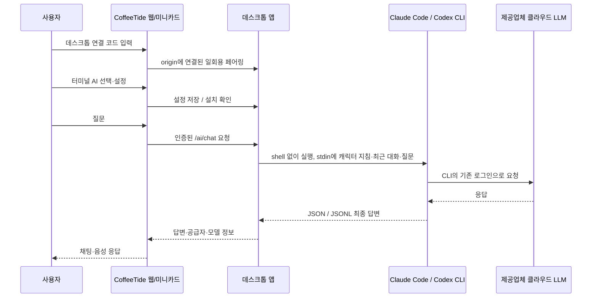

# 터미널 AI 연결 구현서

작성: 2026-10-01 · 기준 소스: 배포 `72105a3` + 계정 표시 로컬 변경 · 구현 상태: CLI 송수신·계정 표시 구현, 실제 CLI 계정 조회 및 응답 검증 완료

## 1. 목적과 범위

CoffeeTide의 캐릭터 대화에 이 PC에 설치하고 로그인한 **Claude Code / Codex CLI**를 연결한다. 모델은 해당 서비스의 클라우드에서 실행하므로 Ollama나 별도 GPU 서버는 필요 없다. CLI 설치·로그인·사용 한도는 각 제공업체가 관리한다. CoffeeTide는 인증 파일을 읽거나 계정 토큰을 복사하지 않는다.

첫 구현은 공급자 선택, 실행 파일·작업 폴더·모델 설정, 설치 확인, 질문/답변 송수신과 취소까지다. 캐릭터 말투와 최근 대화를 전달한다. 레벨별 전문 스킬, MCP별 허용 정책, 파일 수정·배포·외부 서비스 쓰기는 후속 범위다. CLI를 호출하는 것만으로 모든 스킬/MCP를 제품 기능으로 제공한 것으로 표현하지 않는다.

## 2. 연결 구조

웹 서버/Vercel이 사용자 PC의 터미널을 실행하지 않는다. 웹이 기존 `127.0.0.1:47381` 데스크톱 브리지를 통해 실행을 요청한다. 보조 앱을 실행하고 6자리 코드로 연결해야 한다. HTTPS 웹에서 로컬 네트워크 권한이 필요한 경우 브라우저 안내를 따른다.

## 3. 사용자 흐름

1. PC에 사용할 CLI를 설치하고 일반 터미널에서 로그인한다 (`claude` / `codex`).
2. 업데이트한 CoffeeTide 데스크톱 앱을 실행하고 웹과 페어링한다.
3. 설정 → AI·자동화 → AI 바리스타에서 `기본 AI`, `Claude Code`, `Codex CLI` 중 선택한다.
4. 실행 파일은 자동 탐색한다. 필요하면 네이티브 실행 파일의 절대 경로를 지정한다. `.cmd`/`.ps1`과 자유 형식 셸 명령은 받지 않는다.
5. 작업 폴더를 지정한다. 비워 두면 앱의 전용 AI 작업 폴더를 사용한다. 모델을 지정하지 않으면 Claude는 CLI 모델 설정을 따르고, Codex는 바리스타 실행 기본값을 사용한다. Codex의 `--ignore-user-config` 때문에 개인 `config.toml`의 모델 설정까지 상속하는 것은 아니다.
6. `저장·설치·계정 확인`은 `--version`과 공식 계정 조회를 실행한다. 이메일·요금제·조회 시각을 표시한다. 로그인 확인과 실제 응답 성공은 구분한다.
7. 질문을 보내면 선택한 CLI 결과가 동일 채팅/미니카드에 표시된다. 연결·로그인·할당량 오류를 명시하고 다른 AI로 조용히 전환하지 않는다.

## 4. 실행 계약

| 항목 | 규약 |
|---|---|
| Claude Code | `-p --output-format json --no-session-persistence`, 기존 OAuth 로그인을 유지하는 safe mode, 기본 도구와 MCP 자동 실행 제외 |
| Codex CLI | `exec --json --sandbox read-only --ephemeral --skip-git-repo-check --ignore-user-config --ignore-rules`, 사용자 MCP 설정의 자동 상속 제외 |
| 입력 | 캐릭터 지침, 최근 대화, 현재 질문. 메일·파일·업무 데이터 전체는 자동 전송하지 않음 |
| 실행 | `spawn(executable, args, {shell:false, windowsHide:true})`, 질문은 stdin에만 기록 |
| 출력 | Claude의 `result`, Codex의 완료된 `agent_message`만 채팅 답변으로 취급. 진단 로그·추론 로그는 답변으로 사용하지 않음 |
| 동시 실행 | 앱당 한 요청. 중복 요청은 명시적 busy 오류 |
| 한도 | 요청 크기·출력 크기·시간 제한, 취소/연결 해제/앱 종료 시 실행 중 프로세스 정리 |
| 오류 | 설치 누락, 버전 불일치, 인증/할당량, 빈 답변, 시간 초과, 취소를 성공 답변과 구분 |
| 보관 | 실행 경로·작업 폴더·모델 설정만 데스크톱 preferences에 저장. CLI 실행 세션은 일시적이며 웹의 기존 채팅 보관 정책은 유지 |

CLI 자체의 인증/진단 데이터와 제공업체 보관 정책까지 CoffeeTide가 제거한다고 주장하지 않는다. 모델이 답변했다고 업무·파일·외부 데이터 변경 성공으로 간주하지 않는다.

## 5. 브리지 API

페어링 토큰과 **페어링한 정확한 origin**을 모두 검증한다. 설정/실행은 로컬 네트워크에서만 허용한다.

- `POST /ai/config`: 공급자 설정 조회 또는 저장. 실행 파일/폴더 존재 여부 검증.
- `POST /ai/check`: 선택한 CLI 버전·설치 상태 확인. 모델 호출 없음.
- `POST /ai/status`: 계정·조회 시각·최근 응답 성공 시각·사용량 메뉴 조회. `refresh:true`일 때 CLI 공식 계정 조회를 실행한다. 모델 호출 없음.
- `POST /ai/models`: 선택한 CLI의 모델 목록 메타데이터 조회. 페어링 origin·토큰 검증 및 재페어링 중 결과 폐기를 적용한다. 모델 추론 요청 없음.
- `POST /ai/chat`: 공급자·requestId·prompt를 받고 최종 답변 반환.
- `POST /ai/cancel`: 같은 연결에서 소유한 requestId 취소.

재페어링, 연결 해제, 연결 만료는 이전 실행을 취소한다. 토큰과 origin이 일치하지 않으면 설정/실행을 거부한다. 임의 실행 인자, 셸 문자열, 추가 환경변수, 토큰은 웹에서 받지 않는다.

## 6. 구현 파일

- `desktop/cli-ai.cjs`: 설정 검증, CLI 자동 탐색, 버전 검사, 프로세스 실행·취소, 결과 파싱.
- `desktop/cli-account.cjs`: 공식 계정 응답의 필드 허용 목록, Codex 읽기 전용 계정 RPC, 인증 방식별 사용량 안내.
- `desktop/bridge.cjs`, `desktop/main.cjs`: 인증된 라우트, preferences 연결, 종료 정리.
- `src/lib/ai/desktopAi.ts`: 페어링된 브리지 등록, 요청/취소와 입력 구성.
- `src/app/components/settings/TerminalAiSection.tsx`: 공급자·경로·폴더·모델 설정.
- `src/app/components/barista/DesktopBaristaConnector.tsx`: 페어링 수명에 맞춰 AI 브리지 등록.
- `src/lib/ai/harness.ts`, `src/app/page.tsx`: 공급자 선택과 기존 채팅/음성 경로 연결.

## 7. 검증과 완료 조건

자동 검사는 Mock CLI로 명령 주입 방지, 한국어 출력, JSON/JSONL 오류, 한도, 동시 요청, 취소·프로세스 정리, origin/토큰 경계를 검사한다. Mock 검사는 실계정 LLM 결과가 아니다.

타입 검사·린트·관련 웹 테스트·데스크톱 테스트와 빌드를 수행한다. 실제 설치된 CLI의 버전 확인과, 가능한 경우 단순 질문의 실계정 왕복을 별도 기록한다. 브라우저 E2E, HTTPS 로컬 네트워크 정책, 재패키징·배포 여부를 자동 검사와 구분한다.

## 8. 후속: 전문 스킬과 레벨

김부장(기획), 테드(개발), 루미엘(R&D)의 `전문 스킬 → 필요한 도구 → 허용 정책`을 별도 등록한다. 친밀도와 전문 숙련도를 분리하고, 레벨은 업무 능력 노출에만 사용한다. 실제 MCP/파일 쓰기를 연결할 때 요청 미리보기·승인·취소·감사 기록과 실행 결과 표시를 확장한다. 최신 기술 팁에는 실제 검색 근거와 날짜를 포함한다.

## 9. 공식 근거

- [Claude Code programmatic usage](https://code.claude.com/docs/en/headless)
- [Claude Code CLI reference](https://code.claude.com/docs/en/cli-reference)
- [Codex non-interactive mode](https://learn.chatgpt.com/docs/non-interactive-mode)
- [Codex authentication](https://learn.chatgpt.com/docs/auth)

`--bare`는 Claude 구독 OAuth를 읽지 않으므로 이 구현의 기본 옵션으로 쓰지 않는다. `--safe-mode`와 명시적 도구 제한으로 로그인 방식과 실행 권한을 분리한다.

## 10. 구현과 검증 기록 (2026-10-01)

- 공급자 선택, 실행 경로/작업 폴더/모델 설정, 버전 검사, 캐릭터·최근 대화 전달, 채팅/미니카드/음성 결과 반환, 취소와 연결 해제 정리를 구현했다.
- CLI 토큰을 읽거나 복사하지 않는다. 페어링한 origin과 브리지 토큰이 모두 일치해야 요청을 허용한다.
- 실제 계정 CLI 왕복: Claude Code `2.1.286`, Codex CLI `0.155.0` 모두 개인정보 없는 합성 질문에 **연결 확인 완료** 응답을 반환했다. Mock 출력이 아니다. 캐릭터 장기 대화·전문 스킬·MCP 실행까지 검증한 결과는 아니다.
- 웹 전체 테스트 74파일/405건, 데스크톱 테스트 24건 통과. 한국어 입력 크기 제한 검사를 포함해 터미널 AI 관련 웹 테스트 5건도 통과했다. 관련 파일 린트·타입 검사·프로덕션 빌드 및 Electron 스모크 통과.
- 전체 린트에는 기준 소스의 `BaristaIdleCompanion.tsx` 오류 3건이 남아 있다: 선언 전 `speakVoice`/`handleDismissAll` 참조, 음성 interim 입력의 effect 내 setState. 이 변경의 파일에서는 린트 오류가 없다.
- 빌드의 Obsidian 동적 파일 접근 경고 2건은 기존 상태다.
- Windows 샌드박스에서 테스트 실행기 spawn EPERM이 발생해 정상 실행 환경에서 다시 검증했다.
- 로컬 브라우저에서 공급자 선택과 미연결 안내를 확인했다. 브라우저 → Electron → 실계정 CLI 전체 연결은 아직 E2E로 검증하지 않았다. HTTPS 배포의 로컬 네트워크 권한과 macOS는 별도 검증 대상이다.

실행: 루트에서 `npm run desktop:start` 후 웹과 페어링한다. 자동 실계정 검사는 `node desktop/scripts/cli-ai-smoke.cjs --live`로 명시적으로 실행한다.

## 11. 릴리스와 배포 (2026-10-01)

계정 표시 추가 변경은 기존 릴리스에 아직 포함되지 않았다. 아래 릴리스 정보는 배포된 `72105a3` 기준이다.

- 웹 버전: **1.2.4**. `package.json`, 잠금 파일, `APP_VERSION`, 사용자용 릴리스 노트를 함께 갱신한다. Git 태그는 `v1.2.4`를 사용한다.
- Windows 바리스타: **0.1.1**. 네이티브 패키지의 버전과 두 번째 태그 `barista-v0.1.1`을 사용한다. 웹과 데스크톱 태그는 같은 소스 커밋을 가리킨다.
- Windows ZIP은 GitHub Release에 저장하며 SHA-256 목록을 함께 게시한다. 큰 바이너리는 Git 저장소와 Vercel 배포 소스에서 제외한다.
- `/download/CoffeeTideBarista.zip`은 해당 버전의 GitHub ZIP으로 임시 리다이렉트한다. 이후 버전은 새 릴리스와 새 다운로드 목적지를 함께 갱신한다.
- 패키징 앱은 기본적으로 운영 도메인을 연다. 소스 실행은 localhost 기본값과 `COFFEETIDE_URL` 재정의를 유지한다.
- 서버 배포는 기존 `main` → Vercel 연동을 이용한다. 완료 판정은 해당 커밋의 Vercel 성공 상태와 운영 웹 버전·다운로드 응답을 확인한 뒤에만 한다.
- v0.1.1 ZIP: 173,608,069 bytes (165.57 MiB), SHA-256 `fba8d7d9bbc073e2eddf587c48e422bf687558aad9c2726e08e7dfa68bb86dfb`. ASAR 소스·버전 및 압축 밖 네이티브 스크립트가 원본과 일치함을 확인했다.
- 패키지의 Windows EXE 실행은 검증 PC의 앱 제어 정책에서 차단되었다. 정책을 변경하지 않았으며 패키지 자체의 실행 성공으로 기록하지 않는다. 개발용 공식 Electron 런타임의 스모크는 통과했다.

## 12. 계정 표시 추가 (로컬 소스)

- 웹 **터미널 AI 연결**과 데스크톱 **⚙ 설정**에 사용 계정 이메일, 요금제, 계정 조회 시각, 최근 실제 응답 성공 시각을 표시한다. 데스크톱 창은 280×280이며 설정만 내부 스크롤한다.
- Claude는 `auth status` JSON, Codex는 일시적 stdio `app-server`의 `initialize → account/read(refreshToken:false)`를 사용한다. 계정 조회로 모델 turn이나 스레드를 만들지 않는다. 로그인 확인과 실제 대화 성공을 구분한다.
- 이메일·요금제·조직명·인증 방식만 필드 허용 목록으로 추출한다. 인증 파일을 직접 읽거나 원문 stdout/토큰을 UI에 보내지 않는다. 조회 실패는 계정 미확인으로 표시하며 과거 이메일을 남기지 않는다. 계정 또는 실행 설정이 바뀌면 과거 성공 상태를 초기화한다.
- API 키 인증은 구독 이메일을 대신 표시하지 않는다. CLI가 이메일을 제공하지 않으면 그 사실을 표시하고 API Usage로 안내한다. Codex `CODEX_API_KEY` 환경변수의 실행 우선순위도 반영한다.
- Claude: **설정 → Usage**, CLI `/usage`. Codex: CLI `/status`의 한도 및 버전별 `/usage` 활동 메뉴를 안내한다. 잔여 한도·청구 금액을 로컬 추정 수치로 표시하지 않는다. 브라우저 로그인 계정은 CLI와 다를 수 있으므로 확인 문구를 표시한다.
- 계정 정보와 응답 확인 상태는 데스크톱 메모리에만 보관한다. 웹 연결 해제 시 브라우저 계정 상태를 비우며, 계정 조회도 페어링 토큰·정확한 origin을 검증한다. 조회 도중 재페어링되면 이전 연결에 결과를 반환하지 않는다.
- 웹 74파일/407건, 데스크톱 29건 테스트, 타입 검사·프로덕션 빌드 통과. 관련 변경의 린트 통과, 기존 BaristaIdleCompanion 오류 3건은 동일하다. 빌드의 기존 Obsidian 경고 2건도 동일하다.
- 실제 Claude `2.1.286`의 로그인 이메일·Max 및 Codex `0.155.0`의 이메일·Pro 조회를 확인했다. 개발 Electron `--smoke-test --smoke-account`에서 실제 이메일 표시와 설정 영역 경계를 확인했다. 두 CLI의 합성 질문 실제 응답도 성공했다.
- 로컬 웹의 미연결 계정 대기·사용량 안내를 브라우저에서 확인하고 검증 설정을 복원했다. 개발 바리스타를 새 소스로 재실행했다. 브라우저에서 실제 페어링한 전체 왕복·운영 HTTPS 정책·macOS 검증과는 구분한다.
- 운영 웹과 배포 ZIP은 기존 릴리스이며 이번 변경은 커밋·푸시·새 ZIP 배포 전이다. 서명된 패키지 실행 검증을 의미하지 않는다.

공식 조회 계약: [Claude CLI auth status](https://code.claude.com/docs/en/cli-reference), [Claude /usage](https://code.claude.com/docs/en/commands), [Codex account/read](https://learn.chatgpt.com/docs/app-server), [Codex 사용량 메뉴](https://learn.chatgpt.com/docs/developer-commands).

## 13. 데스크톱 캐릭터 대화창 (2026-10-01)

- 사진 오른쪽 아래 표시 위치를 드래그 영역 위의 독립적인 `no-drag` 대화 버튼으로 만든다. 컵 모드에도 같은 버튼을 제공한다. 대화창을 열 때만 320×440으로 확장하고 접으면 기존 280×280으로 돌아간다. 오른쪽 아래 위치를 유지하고 화면 작업 영역 안으로 보정한다.
- 기본 조작(커피·웹 열기·설정·숨기기)을 유지한다. 입력과 대화/업무 모드, 커피·응원·오늘 할 일 빠른 질문을 제공한다. Enter 전송과 Shift+Enter 줄바꿈을 지원하고 IME 조합 중 전송을 막는다.
- 전송 경로는 로컬 renderer → 검증된 IPC → 페어링 bridge의 대기 요청 → 웹 `DesktopBaristaConnector` → 기존 `askCopilot` → `/chat/result` → 로컬 대화창이다. 기본 AI와 선택한 CLI를 모두 기존 경로로 사용하며 웹 탭 연결이 필요하다. 업무 모호성 해소 후보는 `desktop` 채널로 분리한다.
- 요청은 임의 UUID로 식별하고 결과 도착 전에는 `/state`에서 재전달한다. 웹은 요청 ID별 모델 실행 결과를 보관해 수신 재시도 시 모델을 중복 호출하지 않는다. 결과 HTTP 전송만 재시도한다.
- 정확한 페어링 origin과 토큰으로 결과를 검증한다. 알 수 없거나 이미 종료된 요청 ID, 빈/초과 답변은 거부한다. 3분 시간 초과, 연결 해제, 재페어링, 캐릭터/공급자 변경 시 이전 대기 요청을 종료한다. 웹 연결이 바뀐 뒤 옛 답변을 새 연결에 보내지 않는다.
- 앱 메모리에 최근 10문답을 표시하며 완료된 최근 4문답을 다음 질문에 전달한다(메시지당 1,200자). 질문 6,000자, 답변 12,000자 제한이며 HTML을 실행하지 않고 텍스트로 표시한다. 창을 접어도 대기 요청은 유지하고 미확인 답변 표시를 제공한다. 디스크에는 대화를 저장하지 않는다.
- 데스크톱 32건, 관련 웹 11건, 타입 검사와 변경 파일 린트 통과. Electron 스모크에서 클릭 영역·한글 조합·답변·문맥·업무 모드·접기·미확인 표시·연결 해제·기존 드래그/설정/단축키를 확인했다. 스모크 답변은 명시적인 샘플이며 실계정 모델 응답 증거가 아니다.
- 웹 전체 75파일/411건과 운영 빌드 통과(기존 Obsidian 경고 2건 유지). 웹 **v1.2.7 / 2f34686**을 배포했고 운영 번들의 대화 요청·답변 전달 코드를 확인했다. 로컬 바리스타를 새 소스로 정상 종료·재실행하고 상태 응답과 단축키 준비를 확인했다. 재연결한 실제 사용자 웹 → LLM 전체 왕복은 이번 검사에 포함하지 않았다.
- 데스크톱 수정은 로컬 소스에 적용했다. 다운로드는 계속 **barista-v0.1.1**이며 새 네이티브 ZIP을 게시하지 않았다. 앱 재시작 후 웹 새로고침과 새 6자리 코드 연결이 필요하다.

## 14. CLI 모델 목록 조회 (2026-10-02)

- 웹의 고정 모델 후보 배열을 제거했다. 설정 진입 시 계정 확인 다음에 모델 목록을 조회하고, 새로고침·자동 선택·직접 입력을 제공한다. 저장된 실행 경로·작업 폴더로 조회하며 경로 저장 후에는 목록을 다시 읽는다. 저장 모델이 목록에 없어도 유지하고 미확인으로 표시한다.
- Claude는 데스크톱에 고정 버전 `@anthropic-ai/claude-agent-sdk@0.3.286`을 설치하고 `Query.supportedModels()`를 호출한다. 설치된 CLI를 명시적으로 지정하고 입력 스트림으로 사용자 메시지를 보내지 않는다. `--safe-mode`, 도구 차단, 비영속 세션을 유지한다. SDK 플랫폼 바이너리는 기본 설치와 패키징에서 제외한다.
- Codex는 stdio App Server의 `initialize → model/list`를 사용한다. 페이지를 끝까지 읽고 숨김 모델, 잘못된 ID, 반복 cursor, 과도한 응답을 거부한다. 기본 추천 여부는 목록의 `isDefault`이며 사용자가 저장한 기본 모델을 뜻하지 않는다.
- 모델 ID·표시명·설명·지원 추론 강도·기본 추천 여부만 전달한다. 모델 목록은 CLI의 카탈로그이며 계정의 실제 추론 권한·잔여량을 보장하지 않는다. 추론 강도는 메타데이터로만 읽으며 이번 변경에서 강도 설정을 추가하지 않았다.
- 데스크톱 **⚙ → 터미널 AI 연결**에도 모델 선택·목록 새로고침·직접 입력·저장을 제공한다. 저장 시 기존 경로와 작업 폴더를 유지한다. 연결 세션 또는 공급자가 바뀌면 이전 결과를 표시하지 않는다. 창 크기는 유지하고 설정 내부만 스크롤한다.
- 조회는 15초로 제한하며 대화/설정 변경과 동시에 실행하지 않는다. 연결 초기화와 앱 종료 시 취소한다. 웹은 같은 연결·공급자의 중복 조회를 합치고, 재페어링 시 화면과 조회 상태를 새로 만든다. 구버전 `/ai/models`의 404는 미지원 안내로 표시하며 고정 목록을 실제 결과로 대신 제시하지 않는다.
- 실제 로컬 CLI 조회에서 Claude 12개, Codex 7개 모델이 반환되었다. Node와 개발 Electron의 `--smoke-models`에서 동일하게 확인했다. 질문·추론 turn 없이 메타데이터만 조회했다. 목록의 모든 모델로 질문을 보내거나 사용 한도를 검증한 것은 아니다.
- 웹 75파일/414건, 데스크톱 37건 테스트와 타입 검사·변경 파일 린트·프로덕션 빌드를 통과했다. 기존 Obsidian 경고 2건은 유지된다. Electron 샘플 UI 검사에서 조회·저장·실패 시 이전 목록 제거·직접 입력·공급자 변경 초기화를 확인했다. 실제 CLI 목록 조회 증거와 샘플 UI 검사 증거를 구분한다.
- 웹 배포 릴리스는 **v1.2.8**, 데스크톱 소스 버전은 **v0.1.2**로 관리한다. 로컬 앱은 새 소스로 재실행해서 사용하며 웹 새로고침과 새 6자리 코드 연결이 필요하다. 다운로드 ZIP은 계속 **barista-v0.1.1**이다. 새 ZIP 게시와 사용자 운영 브라우저에서의 전체 왕복은 이번 반영 범위에 포함하지 않는다.

공식 계약: [Claude Query / ModelInfo](https://code.claude.com/docs/en/agent-sdk/typescript), [Codex model/list](https://learn.chatgpt.com/docs/app-server#models).
