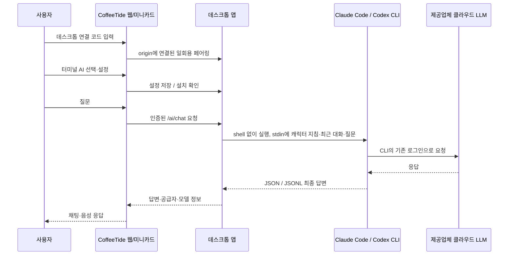

# 터미널 AI 연결 구현서

작성: 2026-10-01 · 기준 소스: `07afe03` 이후 로컬 변경 · 구현 상태: CLI 송수신 구현, 실제 CLI 응답 검증 완료

## 1. 목적과 범위

CoffeeTide의 캐릭터 대화에 이 PC에 설치하고 로그인한 **Claude Code / Codex CLI**를 연결한다. 모델은 해당 서비스의 클라우드에서 실행하므로 Ollama나 별도 GPU 서버는 필요 없다. CLI 설치·로그인·사용 한도는 각 제공업체가 관리한다. CoffeeTide는 인증 파일을 읽거나 계정 토큰을 복사하지 않는다.

첫 구현은 공급자 선택, 실행 파일·작업 폴더·모델 설정, 설치 확인, 질문/답변 송수신과 취소까지다. 캐릭터 말투와 최근 대화를 전달한다. 레벨별 전문 스킬, MCP별 허용 정책, 파일 수정·배포·외부 서비스 쓰기는 후속 범위다. CLI를 호출하는 것만으로 모든 스킬/MCP를 제품 기능으로 제공한 것으로 표현하지 않는다.

## 2. 연결 구조

웹 서버/Vercel이 사용자 PC의 터미널을 실행하지 않는다. 웹이 기존 `127.0.0.1:47381` 데스크톱 브리지를 통해 실행을 요청한다. 보조 앱을 실행하고 6자리 코드로 연결해야 한다. HTTPS 웹에서 로컬 네트워크 권한이 필요한 경우 브라우저 안내를 따른다.

## 3. 사용자 흐름

1. PC에 사용할 CLI를 설치하고 일반 터미널에서 로그인한다 (`claude` / `codex`).
2. 업데이트한 CoffeeTide 데스크톱 앱을 실행하고 웹과 페어링한다.
3. 설정 → AI·자동화 → AI 바리스타에서 `기본 AI`, `Claude Code`, `Codex CLI` 중 선택한다.
4. 실행 파일은 자동 탐색한다. 필요하면 네이티브 실행 파일의 절대 경로를 지정한다. `.cmd`/`.ps1`과 자유 형식 셸 명령은 받지 않는다.
5. 작업 폴더를 지정한다. 비워 두면 앱의 전용 AI 작업 폴더를 사용한다. 모델 이름은 비워 두면 CLI 기본값이다.
6. `설치 확인`은 `--version`만 실행한다. 로그인·실제 모델 성공까지 확인했다는 뜻은 아니다.
7. 질문을 보내면 선택한 CLI 결과가 동일 채팅/미니카드에 표시된다. 연결·로그인·할당량 오류를 명시하고 다른 AI로 조용히 전환하지 않는다.

## 4. 실행 계약

| 항목 | 규약 |
|---|---|
| Claude Code | `-p --output-format json --no-session-persistence`, 기존 OAuth 로그인을 유지하는 safe mode, 기본 도구와 MCP 자동 실행 제외 |
| Codex CLI | `exec --json --sandbox read-only --ephemeral --skip-git-repo-check --ignore-user-config --ignore-rules`, 사용자 MCP 설정의 자동 상속 제외 |
| 입력 | 캐릭터 지침, 최근 대화, 현재 질문. 메일·파일·업무 데이터 전체는 자동 전송하지 않음 |
| 실행 | `spawn(executable, args, {shell:false, windowsHide:true})`, 질문은 stdin에만 기록 |
| 출력 | Claude의 `result`, Codex의 완료된 `agent_message`만 채팅 답변으로 취급. 진단 로그·추론 로그는 답변으로 사용하지 않음 |
| 동시 실행 | 앱당 한 요청. 중복 요청은 명시적 busy 오류 |
| 한도 | 요청 크기·출력 크기·시간 제한, 취소/연결 해제/앱 종료 시 실행 중 프로세스 정리 |
| 오류 | 설치 누락, 버전 불일치, 인증/할당량, 빈 답변, 시간 초과, 취소를 성공 답변과 구분 |
| 보관 | 실행 경로·작업 폴더·모델 설정만 데스크톱 preferences에 저장. CLI 실행 세션은 일시적이며 웹의 기존 채팅 보관 정책은 유지 |

CLI 자체의 인증/진단 데이터와 제공업체 보관 정책까지 CoffeeTide가 제거한다고 주장하지 않는다. 모델이 답변했다고 업무·파일·외부 데이터 변경 성공으로 간주하지 않는다.

## 5. 브리지 API

페어링 토큰과 **페어링한 정확한 origin**을 모두 검증한다. 설정/실행은 로컬 네트워크에서만 허용한다.

- `POST /ai/config`: 공급자 설정 조회 또는 저장. 실행 파일/폴더 존재 여부 검증.
- `POST /ai/check`: 선택한 CLI 버전·설치 상태 확인. 모델 호출 없음.
- `POST /ai/chat`: 공급자·requestId·prompt를 받고 최종 답변 반환.
- `POST /ai/cancel`: 같은 연결에서 소유한 requestId 취소.

재페어링, 연결 해제, 연결 만료는 이전 실행을 취소한다. 토큰과 origin이 일치하지 않으면 설정/실행을 거부한다. 임의 실행 인자, 셸 문자열, 추가 환경변수, 토큰은 웹에서 받지 않는다.

## 6. 구현 파일

- `desktop/cli-ai.cjs`: 설정 검증, CLI 자동 탐색, 버전 검사, 프로세스 실행·취소, 결과 파싱.
- `desktop/bridge.cjs`, `desktop/main.cjs`: 인증된 라우트, preferences 연결, 종료 정리.
- `src/lib/ai/desktopAi.ts`: 페어링된 브리지 등록, 요청/취소와 입력 구성.
- `src/app/components/settings/TerminalAiSection.tsx`: 공급자·경로·폴더·모델 설정.
- `src/app/components/barista/DesktopBaristaConnector.tsx`: 페어링 수명에 맞춰 AI 브리지 등록.
- `src/lib/ai/harness.ts`, `src/app/page.tsx`: 공급자 선택과 기존 채팅/음성 경로 연결.

## 7. 검증과 완료 조건

자동 검사는 Mock CLI로 명령 주입 방지, 한국어 출력, JSON/JSONL 오류, 한도, 동시 요청, 취소·프로세스 정리, origin/토큰 경계를 검사한다. Mock 검사는 실계정 LLM 결과가 아니다.

타입 검사·린트·관련 웹 테스트·데스크톱 테스트와 빌드를 수행한다. 실제 설치된 CLI의 버전 확인과, 가능한 경우 단순 질문의 실계정 왕복을 별도 기록한다. 브라우저 E2E, HTTPS 로컬 네트워크 정책, 재패키징·배포 여부를 자동 검사와 구분한다.

## 8. 후속: 전문 스킬과 레벨

김부장(기획), 테드(개발), 루미엘(R&D)의 `전문 스킬 → 필요한 도구 → 허용 정책`을 별도 등록한다. 친밀도와 전문 숙련도를 분리하고, 레벨은 업무 능력 노출에만 사용한다. 실제 MCP/파일 쓰기를 연결할 때 요청 미리보기·승인·취소·감사 기록과 실행 결과 표시를 확장한다. 최신 기술 팁에는 실제 검색 근거와 날짜를 포함한다.

## 9. 공식 근거

- [Claude Code programmatic usage](https://code.claude.com/docs/en/headless)
- [Claude Code CLI reference](https://code.claude.com/docs/en/cli-reference)
- [Codex non-interactive mode](https://learn.chatgpt.com/docs/non-interactive-mode)
- [Codex authentication](https://learn.chatgpt.com/docs/auth)

`--bare`는 Claude 구독 OAuth를 읽지 않으므로 이 구현의 기본 옵션으로 쓰지 않는다. `--safe-mode`와 명시적 도구 제한으로 로그인 방식과 실행 권한을 분리한다.

## 10. 구현과 검증 기록 (2026-10-01)

- 공급자 선택, 실행 경로/작업 폴더/모델 설정, 버전 검사, 캐릭터·최근 대화 전달, 채팅/미니카드/음성 결과 반환, 취소와 연결 해제 정리를 구현했다.
- CLI 토큰을 읽거나 복사하지 않는다. 페어링한 origin과 브리지 토큰이 모두 일치해야 요청을 허용한다.
- 실제 계정 CLI 왕복: Claude Code `2.1.286`, Codex CLI `0.155.0` 모두 개인정보 없는 합성 질문에 **연결 확인 완료** 응답을 반환했다. Mock 출력이 아니다. 캐릭터 장기 대화·전문 스킬·MCP 실행까지 검증한 결과는 아니다.
- 웹 전체 테스트 74파일/405건, 데스크톱 테스트 24건 통과. 한국어 입력 크기 제한 검사를 포함해 터미널 AI 관련 웹 테스트 5건도 통과했다. 관련 파일 린트·타입 검사·프로덕션 빌드 및 Electron 스모크 통과.
- 전체 린트에는 기준 소스의 `BaristaIdleCompanion.tsx` 오류 3건이 남아 있다: 선언 전 `speakVoice`/`handleDismissAll` 참조, 음성 interim 입력의 effect 내 setState. 이 변경의 파일에서는 린트 오류가 없다.
- 빌드의 Obsidian 동적 파일 접근 경고 2건은 기존 상태다.
- Windows 샌드박스에서 테스트 실행기 spawn EPERM이 발생해 정상 실행 환경에서 다시 검증했다.
- 로컬 브라우저에서 공급자 선택과 미연결 안내를 확인했다. 브라우저 → Electron → 실계정 CLI 전체 연결은 아직 E2E로 검증하지 않았다. HTTPS 배포의 로컬 네트워크 권한과 macOS는 별도 검증 대상이다.

실행: 루트에서 `npm run desktop:start` 후 웹과 페어링한다. 자동 실계정 검사는 `node desktop/scripts/cli-ai-smoke.cjs --live`로 명시적으로 실행한다.

## 11. 릴리스와 배포 (2026-10-01)

- 웹 버전: **1.2.4**. `package.json`, 잠금 파일, `APP_VERSION`, 사용자용 릴리스 노트를 함께 갱신한다. Git 태그는 `v1.2.4`를 사용한다.
- Windows 바리스타: **0.1.1**. 네이티브 패키지의 버전과 두 번째 태그 `barista-v0.1.1`을 사용한다. 웹과 데스크톱 태그는 같은 소스 커밋을 가리킨다.
- Windows ZIP은 GitHub Release에 저장하며 SHA-256 목록을 함께 게시한다. 큰 바이너리는 Git 저장소와 Vercel 배포 소스에서 제외한다.
- `/download/CoffeeTideBarista.zip`은 해당 버전의 GitHub ZIP으로 임시 리다이렉트한다. 이후 버전은 새 릴리스와 새 다운로드 목적지를 함께 갱신한다.
- 패키징 앱은 기본적으로 운영 도메인을 연다. 소스 실행은 localhost 기본값과 `COFFEETIDE_URL` 재정의를 유지한다.
- 서버 배포는 기존 `main` → Vercel 연동을 이용한다. 완료 판정은 해당 커밋의 Vercel 성공 상태와 운영 웹 버전·다운로드 응답을 확인한 뒤에만 한다.
- v0.1.1 ZIP: 173,608,069 bytes (165.57 MiB), SHA-256 `fba8d7d9bbc073e2eddf587c48e422bf687558aad9c2726e08e7dfa68bb86dfb`. ASAR 소스·버전 및 압축 밖 네이티브 스크립트가 원본과 일치함을 확인했다.
- 패키지의 Windows EXE 실행은 검증 PC의 앱 제어 정책에서 차단되었다. 정책을 변경하지 않았으며 패키지 자체의 실행 성공으로 기록하지 않는다. 개발용 공식 Electron 런타임의 스모크는 통과했다.
