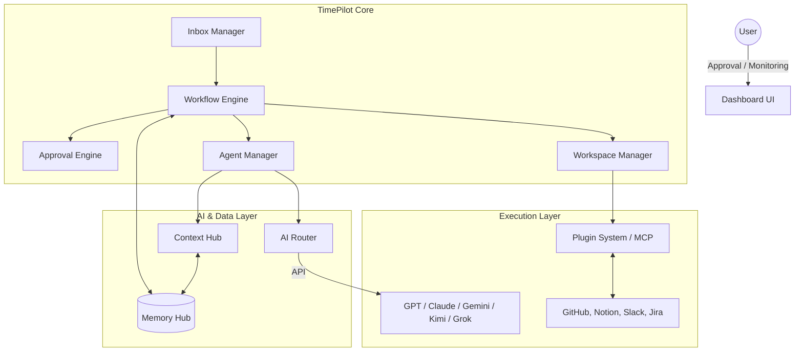
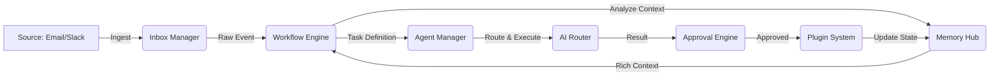
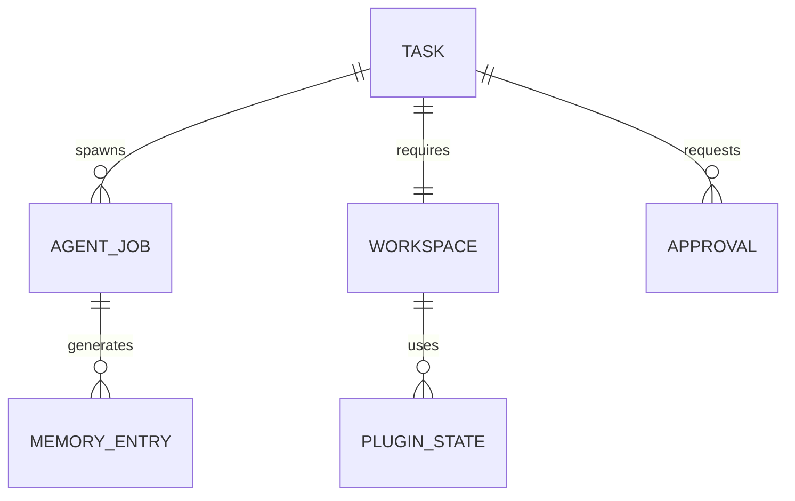
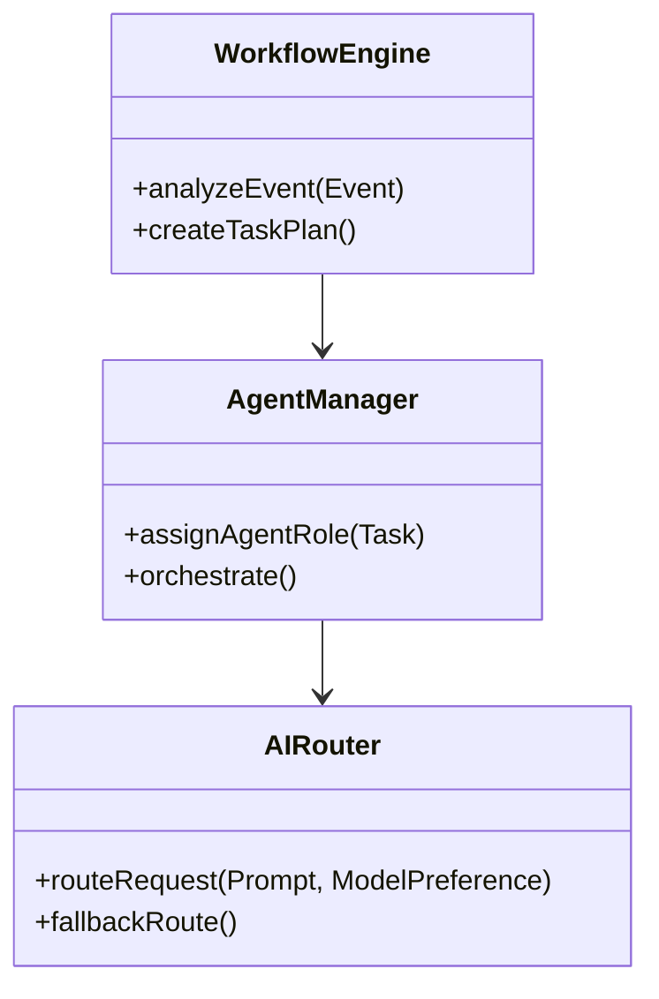
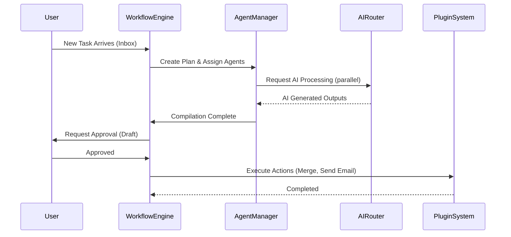
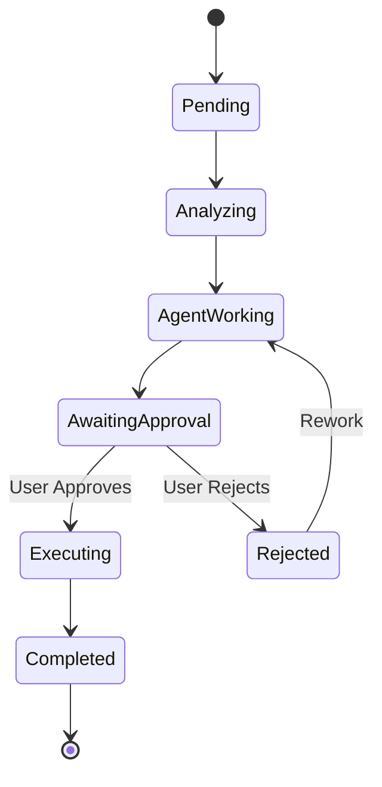

# TimePilot: AI Work Operating System (AI OS) Architecture Spec

> **상태**: 💭 **장기 비전 / 브레인스토밍 문서** (2026-07-21 작성). 구명칭 "TimePilot" 시절의 엔터프라이즈 AI Work OS 구상으로, **현재 coffeeTide의 구현·설계 정본이 아닙니다.** 현재 제품의 정본은 [`00-current-state.md`](./00-current-state.md)(무연동 우선 원칙), 구현 현황은 [`as-built-reference.md`](./as-built-reference.md) 참조. 본문의 기술 스택(Kafka, K8s, Vector DB 등)과 모델명은 작성 시점의 예시이며 확정 사항이 아닙니다.

본 문서는 사용자의 요청을 바탕으로, 단순한 챗봇이나 도우미를 넘어 **"업무의 시작부터 완료까지 AI가 스스로 계획하고 실행하며, 인간은 최종 승인만 담당하는" AI Work OS (TimePilot)**의 아키텍처 설계서입니다.

---

## 1. 전체 시스템 아키텍처 (System Architecture)
모든 시스템은 이벤트 기반(Event-Driven)으로 느슨하게 결합되며, 각 AI 에이전트는 역할을 분담하여 협업합니다.



---

## 2. 모듈 구성도 (Module Composition)
1. **Core Orchestration**: Workflow Engine, Approval Engine, Agent Manager
2. **AI Layer**: AI Router, Context Hub, Memory Hub
3. **Integration Layer**: Inbox Manager, Workspace Manager, Plugin System
4. **Presentation Layer**: Dashboard, Notification Service

---

## 3. 데이터 흐름도 (Data Flow)


---

## 4. 이벤트 흐름 (Event Flow)
시스템 내의 모든 상태 변화는 비동기 이벤트로 처리됩니다.
- `TaskReceivedEvent` → Inbox에서 수집
- `TaskAnalyzedEvent` → Workflow Engine이 우선순위 및 필요 Agent 산출
- `WorkspaceCreatedEvent` → 격리된 작업 공간 할당
- `AgentAssignedEvent` → Planner/Coder/Reviewer 배정
- `ExecutionStartedEvent` → AI 작업 개시
- `ApprovalRequestedEvent` → 사용자 승인 대기
- `ExecutionCompletedEvent` → 최종 반영 및 Memory 업데이트

---

## 5. AI Agent 구조 (Agent Architecture)
각 AI는 하나의 거대한 프롬프트를 받지 않고, 명확한 **Role(역할)**을 가집니다.
- **Planner**: 전체 작업 단계를 쪼개고 하위 Agent에게 배분.
- **Coder**: 실제 코드 작성 및 수정 (Codex, Kimi 활용).
- **Reviewer**: Coder가 작성한 산출물 검토 및 보안 취약점 점검.
- **Tester**: 테스트 코드 작성 및 검증.
- **Researcher**: 필요시 웹이나 사내 위키 검색 (Grok 활용).
- **Document Writer**: 완료 후 산출물 및 회의록 작성 (Claude 활용).

---

## 6. Workspace 구조 (Workspace Structure)
Task가 실행될 때마다 **독립된 일회성(Ephemeral) 샌드박스**가 생성됩니다.
- **Code Workspace**: Git Worktree를 활용해 메인 브랜치와 격리된 환경에서 코드 수정 및 빌드.
- **Document Workspace**: Notion/Google Docs 임시 초안 저장소.
- **Lifecycle**: `생성` → `AI 작업` → `사용자 승인` → `Merge/Publish` → `파기(Cleanup)`

---

## 7. Memory 구조 (Memory Architecture)
AI의 기억 상실증을 막기 위해 2단계 메모리 구조를 사용합니다.
- **단기 기억 (Session Memory)**: Redis 활용. 현재 진행 중인 Task의 컨텍스트, 에러 로그, 중간 산출물.
- **장기 기억 (Long-term Memory)**: Vector DB (Qdrant/Milvus) + RDB 활용. 과거의 결정 사항, 완료된 PR, 사내 정책, 컨벤션.

---

## 8. Context 전달 방식 (Context Routing)
모든 AI가 동일한 데이터를 보지 않습니다. **Context Hub**가 Memory Hub에서 데이터를 조회 후, Agent의 Role에 맞춰 필터링(Masking)합니다.
- **Reviewer**: 수정된 코드 Diff와 보안 가이드라인만 전달.
- **Planner**: 사용자 요구사항 원문과 현재 프로젝트 구조만 전달.
*(목적: Payload 크기 최소화, API 비용 절감, 할루시네이션 방지)*

---

## 9. Plugin Architecture (MCP Compatible)
모든 외부 연동은 **Model Context Protocol (MCP)** 표준을 따르는 플러그인 구조로 설계됩니다.
- 각 플러그인은 `manifest.json`에 자신이 수행할 수 있는 `tools` (예: `github_create_pr`, `notion_write_page`)를 정의합니다.
- 새로운 외부 툴(Jira, Linear 등)이 도입되어도 Core 로직 수정 없이 플러그인만 추가하면 됩니다.

---

## 10. API 설계 (RESTful)
- `POST /api/inbox/webhook` : 외부 채널로부터 업무 수신
- `GET /api/tasks/{taskId}/workflow` : 현재 작업의 진행 노드 상태 조회
- `POST /api/tasks/{taskId}/approve` : 사용자 최종 승인 (Execute 트리거)
- `GET /api/dashboard/metrics` : 토큰 사용량, 비용, Agent 가동률 조회

---

## 11. Database ERD


---

## 12. 클래스 다이어그램 (Core Class)


---

## 13. Sequence Diagram (업무 실행 흐름)


---

## 14. 상태 다이어그램 (State Machine)
Approval Engine이 통제하는 Task Lifecycle입니다.


---

## 15. Folder Structure (Clean Architecture)
```text
src/
 ├── domain/         # Entities (Task, Workspace, Memory)
 ├── application/    # UseCases (WorkflowEngine, ApprovalEngine)
 ├── infrastructure/ # AI Router, Vector DB Clients, API Integrations
 ├── interfaces/     # REST Controllers, Webhook Handlers
 └── plugins/        # MCP Plugins (GitHub, Slack, Notion)
```

---

## 16. 기술 스택 제안 (Tech Stack)
- **Backend/Core**: Node.js (NestJS) 또는 Go (동시성 처리 유리)
- **Frontend**: Next.js, React, TailwindCSS, Zustand
- **Database**: PostgreSQL (메인), Redis (상태 관리), Qdrant/Chroma (Vector DB)
- **AI & Orchestration**: LangChain, LlamaIndex, Model Context Protocol (MCP) SDK
- **Infrastructure**: Docker, Kubernetes, GitHub Actions

---

## 17. 확장성을 고려한 설계 (Scalability)
- **Event-Driven Broker**: 내부 모듈 간 통신에 Kafka 또는 RabbitMQ를 도입하여, 트래픽 폭주 시에도 유실 없이 큐잉되도록 설계합니다.
- **Stateless Agent**: Agent Manager와 AI Router는 상태를 갖지 않도록 설계하여, 필요시 컨테이너를 수평 확장(Scale-out)할 수 있습니다.

---

## 18. 보안 설계 (Security)
- **Secret Management**: 모든 외부 API 키와 DB 접근 정보는 Vault 또는 AWS Secrets Manager로 격리 관리합니다.
- **Sandbox Execution**: 코드 실행이나 스크립트 빌드가 필요한 플러그인은 gVisor나 Firecracker와 같은 마이크로VM 기반 샌드박스 내부에서만 실행되어 호스트 시스템을 보호합니다.

---

## 19. 권한 관리 (RBAC/ABAC)
- 사용자의 직급/부서에 따라 Approval 권한을 차등 부여합니다.
- **최소 권한 원칙(Principle of Least Privilege)**: 각 Agent와 Plugin은 자신이 부여받은 Task 범위 내의 권한(Token)만 임시로 발급받아 사용합니다.

---

## 20. 장애 대응 전략 (Resilience)
- **AI Router Fallback**: GPT-4 서버가 터지면 자동으로 Claude 3.5 Sonnet으로 요청을 우회하도록 Retry/Fallback 정책을 내장합니다.
- **Circuit Breaker**: 외부 연동 서비스(예: Slack API)가 무응답일 경우 지속적인 요청으로 인한 시스템 마비를 막기 위해 서킷 브레이커 패턴을 적용합니다.

---

## 21. MVP와 장기 로드맵 (Roadmap)
- **Phase 1 (MVP)**: 단일 Workspace 구성. 수동 Inbox 입력. Planner와 Coder 에이전트 구축. GitHub 연동을 통한 PR 자동 생성 시스템 완성.
- **Phase 2 (Growth)**: Multi-Agent 협업 체계 도입. Vector DB를 활용한 사내 지식 기반(RAG) Memory 구축. 다양한 Inbox 채널(Slack, 메일) 연동.
- **Phase 3 (Enterprise AI OS)**: Auto-Scaling 기반의 무한 확장이 가능한 Workspace 구축. 완전 자율형 스케줄링 및 부서 간 AI 통신 기능(Multi-Swarm) 추가.
